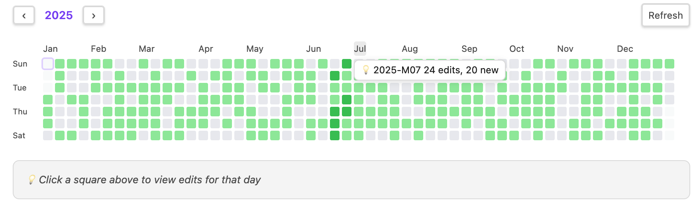
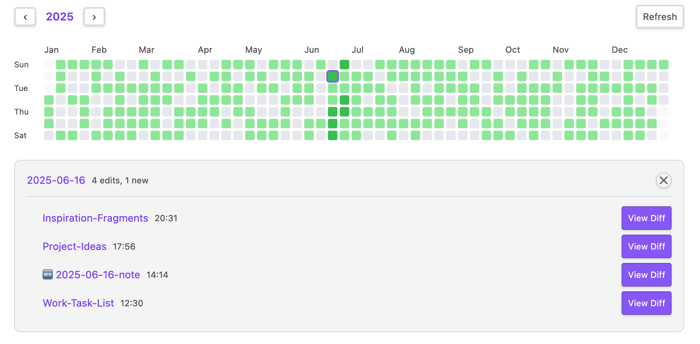
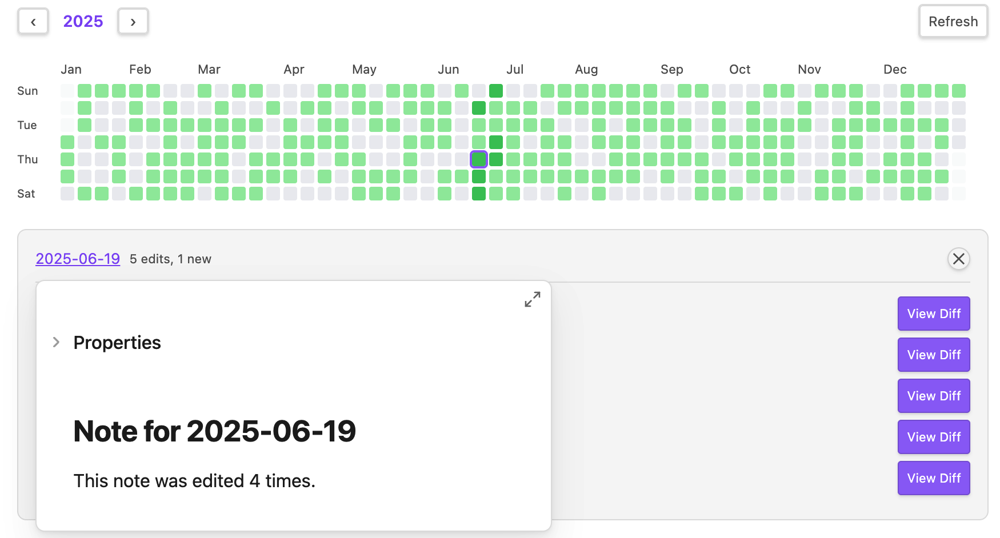
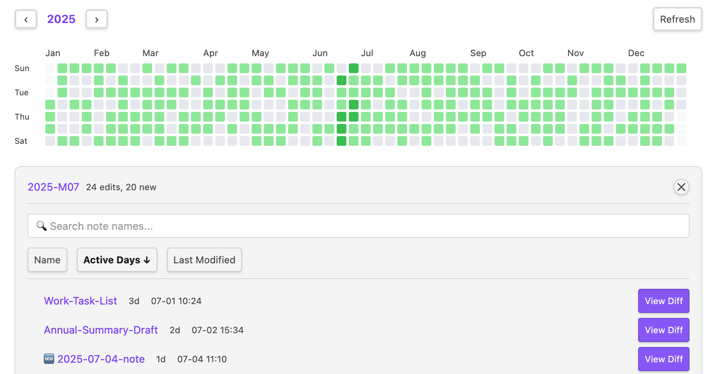
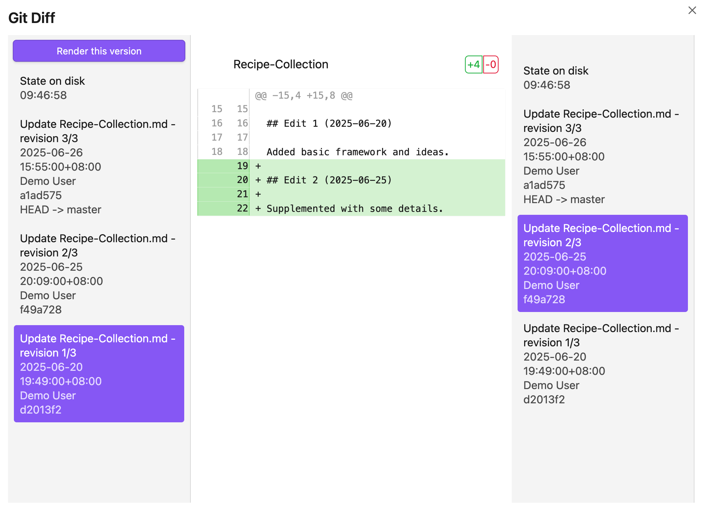

# Obsidian Note Heatmap

[](https://obsidian.md/plugins?id=obsidian-note-heatmap)
[](LICENSE)

> Visualize your note activity with a GitHub-style heatmap. Track writing habits and discover patterns in your knowledge management.

[English](./README.md) | [中文](./README.zh.md)

---

## Why Note Heatmap?

Unlike [Contribution Graph](https://github.com/vran-dev/obsidian-contribution-graph) which maps **one entry to one date**, Note Heatmap supports **list-format dates** to track activity across multiple days:

```yaml
last-modified:
  - 2026-04-01T10:30:00
  - 2026-04-05T17:20:10
  - 2026-04-10T11:30:00
```

A note edited on three different days contributes to all three days — not just the latest one.

---

## Features

**Heatmap** — GitHub Contributions-style annual activity grid with 5-level color depth. Click any day to see modified notes, click a month for a monthly summary.

**Periodic Notes** — Click dates to jump to daily notes, months to monthly notes, year number to yearly notes. Supports hover preview. Folder paths and filename formats are fully customizable.

**Flexible Date Tracking** — Reads frontmatter date fields to track modifications. Supports ISO 8601, `YYYY-MM-DD`, list format, and Obsidian date objects. New notes are auto-identified via the `created` field. Incremental cache for performance.

**Git Diff** *(optional)* — Quickly view per-file Git changes by commit, day, or month. Requires both [Obsidian Git](https://github.com/denolehov/obsidian-git) and [Version History Diff](https://github.com/kometenstaub/obsidian-version-history-diff) plugins (soft dependency — heatmap works fine without them).

**i18n** — Chinese and English. Auto-detects Obsidian language setting.

---

## Installation

### Obsidian Community Plugins (Coming Soon)

Once approved, you will be able to:
1. Settings → Community Plugins → Browse
2. Search "Note Heatmap"
3. Install and enable

### BRAT (Beta Reviewers Auto-update Tool)

For early access before official approval:
1. Install [BRAT](https://github.com/TfTHacker/obsidian42-brat) plugin
2. Run command: "BRAT: Add a beta plugin for testing"
3. Enter: `https://github.com/hzlume/obsidian-note-heatmap`
4. Enable in Settings → Community Plugins

### Manual

1. Download `main.js`, `manifest.json`, and `styles.css` from [releases](https://github.com/hzlume/obsidian-note-heatmap/releases/latest)
2. Copy to `.obsidian/plugins/obsidian-note-heatmap/`
3. Enable in Settings → Community Plugins

---

## Configuration

| Setting | Description | Default |
|---------|-------------|---------|
| Target Field | Frontmatter field for modification dates | `last-modified` |
| Created Field | Frontmatter field for creation dates | `created` |
| Target Folder | Folder to track | *(empty - whole vault)* |

### Supported Date Formats

```yaml
last-modified: 2026-04-14T10:30:00   # ISO 8601
last-modified: 2026-04-14             # Date string
last-modified:                        # List (multiple dates)
  - 2026-04-14
  - 2026-04-15
last-modified:                        # List with time (multiple modifications)
  - 2026-04-14T10:30:00
  - 2026-04-15T11:30:00
```

### Periodic Notes

| Type | Default Format | Example Path |
|------|---------------|-------------|
| Daily | `YYYY-[daily]/YYYY-MM-[daily]/YYYY-MM-DD` | `2026-daily/2026-04-daily/2026-04-14.md` |
| Monthly | `YYYY-[monthly]/YYYY-MM` | `2026-monthly/2026-04.md` |
| Yearly | `YYYY` | `2026.md` |

Each type can be enabled/disabled independently. Folder paths are customizable.

### Git Diff

Enable in settings after installing [Obsidian Git](https://github.com/denolehov/obsidian-git). When enabled, a "View Diff" button appears next to each note in the result panel.

---

## Usage

- **Open**: Click the 📅 icon in the left sidebar, or run "Note Heatmap: Open" from the command palette
- **Navigate years**: Use the ‹ › buttons
- **View day activity**: Click any heatmap square
- **View month summary**: Click a month label
- **Open yearly note**: Click the year number (requires yearly note enabled)
- **Refresh**: Click the refresh button

---

## Plugin Integration

**Obsidian Git** *(soft dependency)* — Required for Git Diff features. Without it, the heatmap still works; only diff viewing is unavailable.

**Version History Diff** — If installed, diff views open in its UI for a richer experience with automatic commit selection.


**Log Keeper** — Automatically generates timestamps in list format as you type. Perfect for tracking multiple modifications throughout the day:

```yaml
last-modified:
  - 2026-04-14T10:30:00
  - 2026-04-14T14:15:00
  - 2026-04-14T16:45:00
```

**Linter / Templater** — Use to auto-populate frontmatter date fields:

```markdown
---
created: <% tp.date.now("YYYY-MM-DD") %>
last-modified: <% tp.date.now("YYYY-MM-DD") %>
---
```
---
## Screenshots

### Annual Heatmap



GitHub Contributions-style annual activity grid with 5-level color depth. Click any date to see modified notes, click a month label for monthly summary.

### Day View



Click any square in the heatmap to view all notes modified on that day, showing last modified time next to each note name.

### Hover Preview



Hover over note links to quickly preview content via Obsidian's native hover preview.

### Month View with Search & Sort



Click a month label to see monthly activity statistics. Supports sorting by name, active days, or last modified time, with search filtering.

### Git Diff Integration



After installing Obsidian Git, click the "View Diff" button to see version history in Version History Diff.

---

## Development

```bash
npm install
npm run dev     # Watch mode (auto-reloads plugin)
npm run build   # Production build
```

**Note:** The build script automatically copies `styles.css` to the vault plugin folder.

### Project Structure

```
src/                  # Source code
├── main.ts           # Plugin entry & lifecycle
├── settings.ts       # Settings interface & defaults
├── settingTab.ts     # Settings UI
├── heatmapView.ts    # Heatmap view (main UI)
├── dataCache.ts      # Data cache (incremental updates)
├── gitService.ts     # Git service (via Obsidian Git API)
├── vhdUtils.ts       # Version History Diff utilities
└── i18n/             # Internationalization
    ├── index.ts
    ├── en.ts
    └── zh.ts

styles.css            # Plugin styles (auto-copied to vault)
```

---

## Changelog

See [GitHub Releases](https://github.com/hzlume/obsidian-note-heatmap/releases) for version history.

---

## License

[MIT](LICENSE)
