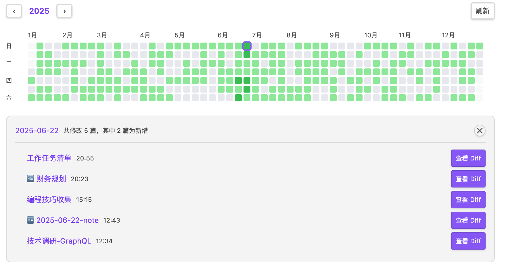
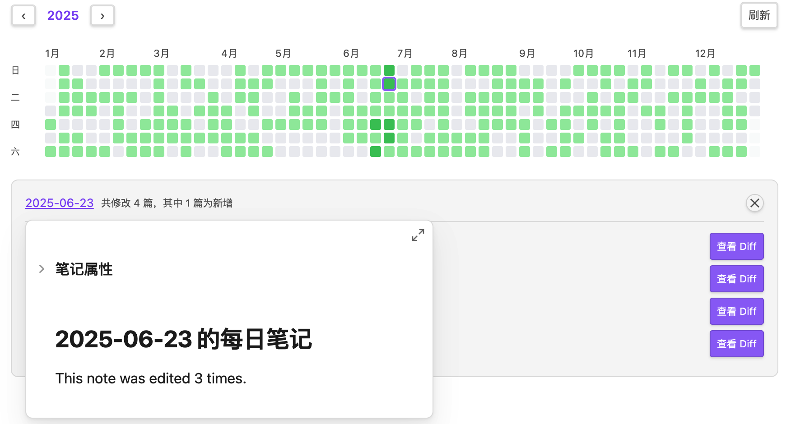
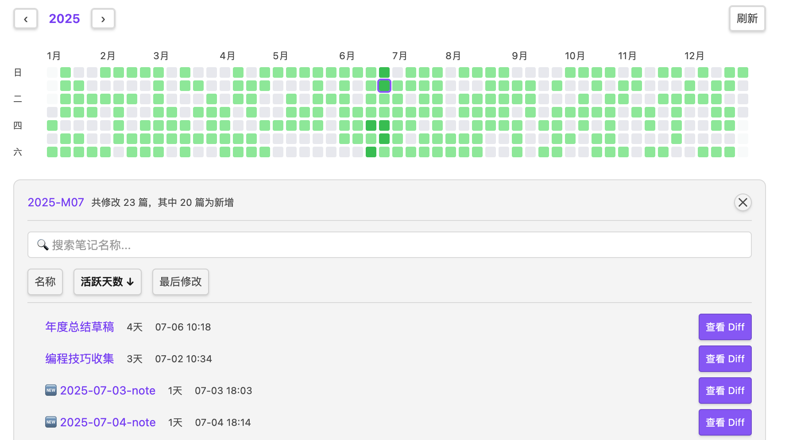
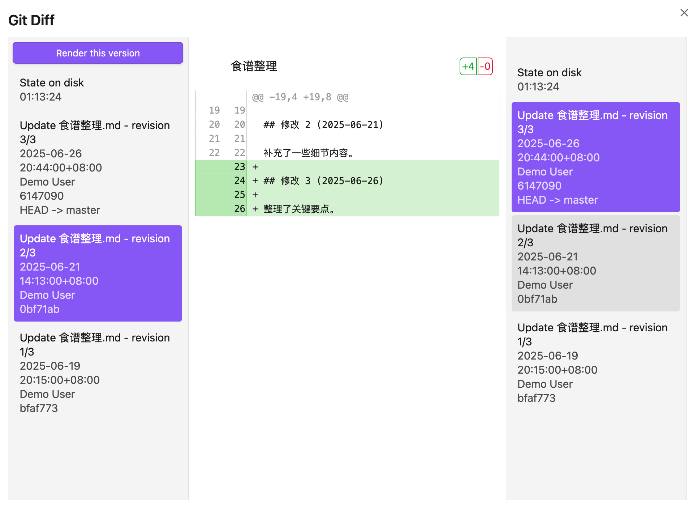

# Obsidian Note Heatmap

[](https://obsidian.md/plugins?id=obsidian-note-heatmap)
[](LICENSE)

> 以 GitHub 风格热力图可视化笔记修改活动，追踪写作习惯，发现知识管理中的模式。

[English](./README.md) | [中文](./README.zh.md)

---

## 为什么选择 Note Heatmap？

与 [Contribution Graph](https://github.com/vran-dev/obsidian-contribution-graph) 的**一个条目对应一个日期**不同，Note Heatmap 支持**列表格式的日期**，可以追踪跨越多天的活动：

```yaml
last-modified:
  - 2026-04-01T10:30:00
  - 2026-04-05T17:20:10
  - 2026-04-10T11:30:00
```

一篇在三天内编辑过的笔记，会在三天都有贡献 —— 而不仅仅是最新那一天。

---

## 功能特性

**热力图** — GitHub Contributions 风格的年度活动网格，5 级颜色深度。点击日期查看当日修改的笔记，点击月份查看月度汇总。

**周期笔记** — 点击日期跳转每日笔记，点击月份跳转月度笔记，点击年份数字跳转年度笔记。支持悬浮预览。文件夹路径和文件格式均可自定义。

**多格式日期追踪** — 读取 frontmatter 日期字段追踪修改记录。支持 ISO 8601、`YYYY-MM-DD`、列表格式及 Obsidian 日期对象。通过 `created` 字段自动识别新增笔记。增量缓存，性能优化。

**Git Diff**（可选）— 快速查看单文件每次提交/每日/每月的 Git 变更。需要 [Obsidian Git](https://github.com/denolehov/obsidian-git) 和 [Version History Diff](https://github.com/kometenstaub/obsidian-version-history-diff) 两个插件的支持（软依赖——不装也不影响热力图核心功能）。

**国际化** — 支持中文和英文，自动检测 Obsidian 语言设置。

---

## 安装

### 从社区插件市场安装（即将推出）

审核通过后，你将可以：
1. 设置 → 社区插件 → 浏览
2. 搜索 "Note Heatmap"
3. 安装并启用

### BRAT（Beta 测试工具）

在官方审核通过前抢先体验：
1. 安装 [BRAT](https://github.com/TfTHacker/obsidian42-brat) 插件
2. 运行命令："BRAT: Add a beta plugin for testing"
3. 输入：`https://github.com/hzlume/obsidian-note-heatmap`
4. 在设置 → 社区插件中启用

### 手动安装

1. 从 [Releases](https://github.com/hzlume/obsidian-note-heatmap/releases/latest) 下载 `main.js`、`manifest.json` 和 `styles.css`
2. 复制到 `.obsidian/plugins/obsidian-note-heatmap/`
3. 在设置 → 社区插件中启用

---

## 配置

| 设置项 | 说明 | 默认值 |
|-------|------|--------|
| 目标字段 | 用于统计修改日期的 frontmatter 字段 | `last-modified` |
| 创建时间字段 | 用于判断新增笔记的 frontmatter 字段 | `created` |
| 目标文件夹 | 统计哪个文件夹下的笔记 | *（空 - 整个仓库）* |

### 支持的日期格式

```yaml
last-modified: 2026-04-14T10:30:00   # ISO 8601
last-modified: 2026-04-14             # 日期字符串
last-modified:                        # 列表（多个修改日期）
  - 2026-04-14
  - 2026-04-15
last-modified:                        # 带时间的列表（多次修改）
  - 2026-04-14T10:30:00
  - 2026-04-15T11:30:00
```

### 周期笔记

| 类型 | 默认格式 | 示例路径 |
|-----|---------|---------|
| 每日 | `YYYY-[daily]/YYYY-MM-[daily]/YYYY-MM-DD` | `2026-daily/2026-04-daily/2026-04-14.md` |
| 月度 | `YYYY-[monthly]/YYYY-MM` | `2026-monthly/2026-04.md` |
| 年度 | `YYYY` | `2026.md` |

每种类型可独立开关，文件夹路径可自定义。

### Git Diff

安装 [Obsidian Git](https://github.com/denolehov/obsidian-git) 后在设置中启用。启用后，结果面板中每篇笔记旁会显示「查看 Diff」按钮。

---

## 使用

- **打开热力图**：点击左侧边栏 📅 图标，或命令面板搜索 "Note Heatmap: 打开笔记热力图"
- **切换年份**：点击 ‹ › 按钮
- **查看单日活动**：点击热力图方块
- **查看月度汇总**：点击月份标签
- **打开年度笔记**：点击年份数字（需启用年度笔记）
- **刷新数据**：点击刷新按钮

---

## 插件集成

**Obsidian Git**（软依赖）— Git Diff 功能需要此插件。不安装不影响热力图核心功能，仅 diff 查看不可用。

**Version History Diff** — 如已安装，diff 视图会使用其界面展示，自动选中相关提交。

**Log Keeper** — 在输入时自动生成列表格式的时间戳。非常适合追踪多次修改：

```yaml
last-modified:
  - 2026-04-14T10:30:00
  - 2026-04-14T14:15:00
  - 2026-04-14T16:45:00
```

**Linter / Templater** — 用于自动填充 frontmatter 日期字段：

```markdown
---
created: <% tp.date.now("YYYY-MM-DD") %>
last-modified: <% tp.date.now("YYYY-MM-DD") %>
---
```

---

## 截图

### 年度热力图


GitHub Contributions 风格的年度活动网格，5 级颜色深度表示活跃度，支持年度导航与悬停查看摘要。点击任意日期查看当日修改的笔记，点击月份标签查看月度汇总。

### 日视图与笔记列表



点击热力图上的日期方块，显示当日修改的所有笔记列表，每篇笔记显示当日最后修改时间，并标识是否是新增笔记。

### 悬停预览



鼠标悬停在笔记链接上，通过 Obsidian 的原生悬停预览快速查看笔记内容，同时支持日/月/年周期笔记的链接与预览。

### 月视图与搜索排序



点击月份标签查看整月笔记活跃度统计，支持按名称、活跃天数、最后修改时间排序，可搜索过滤笔记。


### Git Diff 集成



安装 Obsidian Git 后，点击「查看 Diff」按钮在 Version History Diff 中查看文件的版本变更历史。

---

## 开发

```bash
npm install
npm run dev     # 开发模式（热重载）
npm run build   # 生产构建
```

**注意：** 构建脚本会自动将 `styles.css` 复制到 vault 插件目录。

### 项目结构

```
src/                  # 源代码
├── main.ts           # 插件入口与生命周期
├── settings.ts       # 设置接口与默认值
├── settingTab.ts     # 设置面板
├── heatmapView.ts    # 热力图视图（主 UI）
├── dataCache.ts      # 数据缓存（增量更新）
├── gitService.ts     # Git 服务（通过 Obsidian Git API）
├── vhdUtils.ts       # Version History Diff 工具函数
└── i18n/             # 国际化
    ├── index.ts
    ├── en.ts
    └── zh.ts

styles.css            # 插件样式（自动复制到 vault）
```

---

## 更新日志

版本历史请查看 [GitHub Releases](https://github.com/hzlume/obsidian-note-heatmap/releases)。

---

## 许可证

[MIT](LICENSE)
